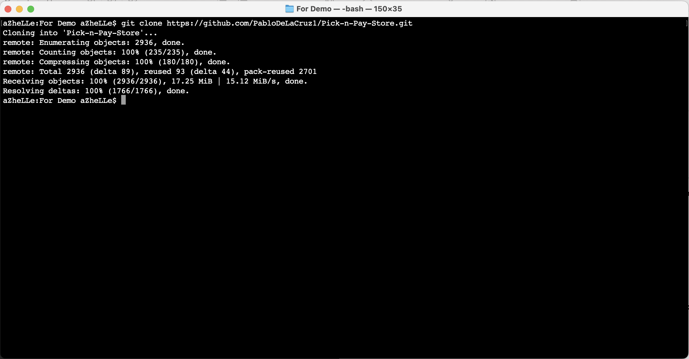
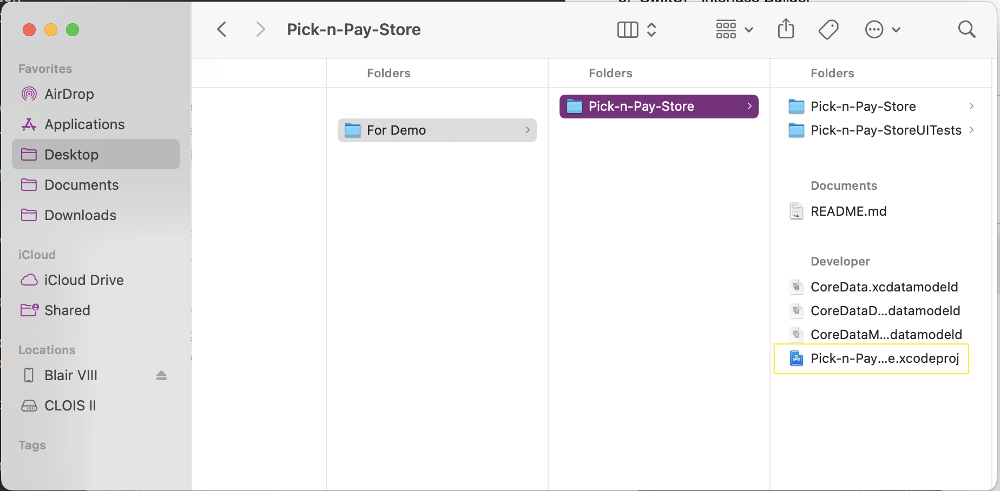
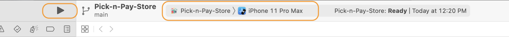
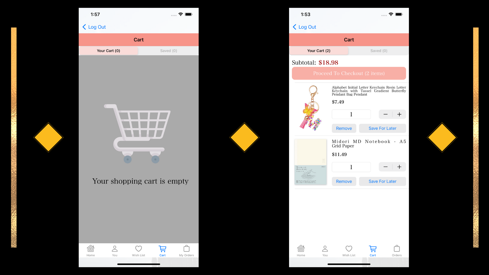
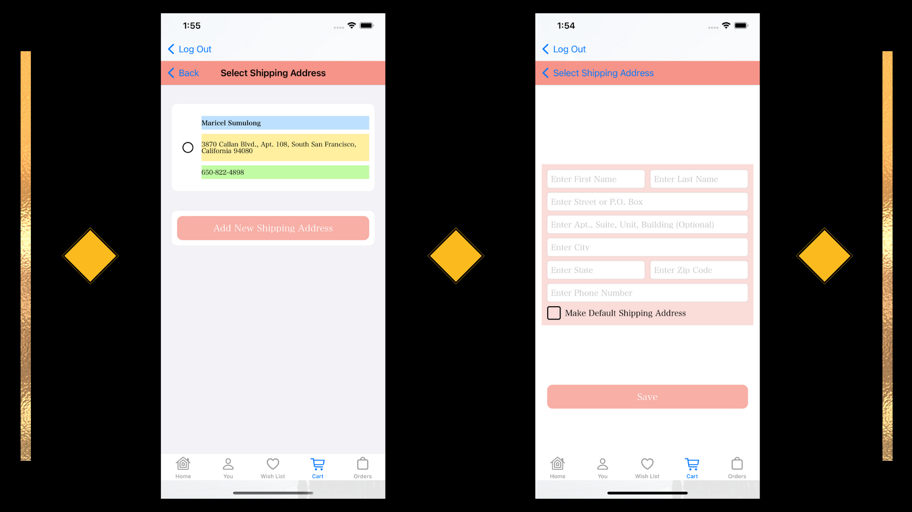
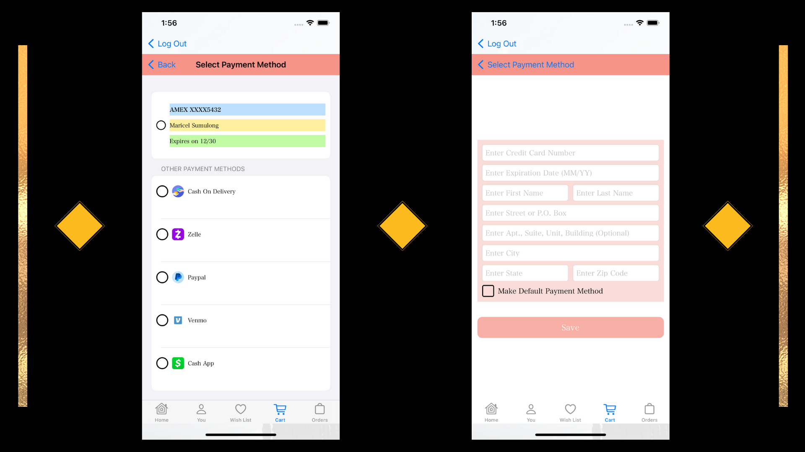

# Shopper Pick N' Pay: An Online Store Application

## Project Description

This project is a single base application that behaves like e-commerce applications such as Amazon, Etsy and more.

## Technologies Used

1. XCode 13 - IDE
2. Swift 5 - Programming Language
3. CoreData - Data Storage
4. iOS 15 - IOS Version
5. SwiftUI - Interface Builder
6. UIKit - Interface Builder

## Features

1. SwiftUI - UIKit (vice-versa) Implementation
2. CoreData CRUD Implementation

## Getting Started

1. All we need to do is to clone the project into your desired folder using the following command: ***git clone https://github.com/PabloDeLaCruz1/Pick-n-Pay-Store.git***.

2. Once cloning is done, switch to the Pick-n-Pay-Store folder and click on ***Pick-n-Pay-Store.xcodeproj***

3. Select "iPhone 11 Pro Max" as your simulator and click the Play button to start the application.

4. Voila, you can now start signing-up to play around with the application

    
## Usage

Below are screenshots of the project in action:

<h3 align="center">LANDING PAGES</h3>

<i>Left Image: Home Page • Middle Image: Sign-Up Page • Right Image: Login Page</i>

<h3 align="center">HOME FEATURE</h3>

<i>Left Image: Regular View • Right Image: Detail View</i>

<h3 align="center">CART FEATURE</h3>

<i>Left Image: Empty Cart View • Right Image: Cart With Items</i>

<h3 align="center">CART FEATURE: SHIPPING INFORMATION</h3>

<i>Left Image: Available Shipping Addresses • Right Image: Adding Shipping Address Form</i>

<h3 align="center">CART FEATURE: PAYMENT INFORMATION</h3>

<i>Left Image: Available Payment Methods • Right Image: Adding Payment Method Form For Debit / Credit Cards</i>

<h3 align="center">CART FEATURE: SAVED ITEMS</h3>

<i>Left Image: Empty Saved Cart • Right Image: Cart With Saved Items</i>

<h3 align="center">ORDERS FEATURE</h3>

<i>Left Image: Place Your Order Page • Right Image: Orders Page</i>

## Contributors

<a href="https://github.com/PabloDeLaCruz1" title="Click for Github Portfolio">***Pablo DeLa Cruz***</a>

<a href="https://github.com/azhelle16" title="Click for Github Portfolio">***Maricel Louise Sumulong***</a>

<a href="https://github.com/stephaniemarin" title="Click for Github Portfolio">***Stephanie Marin***</a>

<a href="https://github.com/Merderr" title="Click for Github Portfolio">***Hamza Ahmed***</a>

<a href="https://github.com/JBell13" title="Click for Github Portfolio">***Joseph Bell***</a>

## Note
This is a group project under the supervision of Ms. Asha Rani. If you find your icons in this application, please e-mail me at mllsumulong@gmail.com for proper attribution.

## Credits

Icons: 

***https://www.flaticon.com/authors/freepik***

***Main Logo:***
<a href="https://www.vectorstock.com/royalty-free-vector/brain-tech-logo-design-template-vector-31362674">Vector image by VectorStock / vectorstock</a>

***Open Sources***

- https://awesomeopensource.com/project/shameemreza/uray
- Ray Wenderlich
- https://www.brandcrowd.com/
- https://github.com/vadymmarkov/Fakery

## Main Team Documents

### [Outline](https://docs.google.com/document/d/18oLW9TXvV11Yx9kF4zBf7WkKbiuCD5UP4V5R8_vXVdo/edit?usp=sharing)

